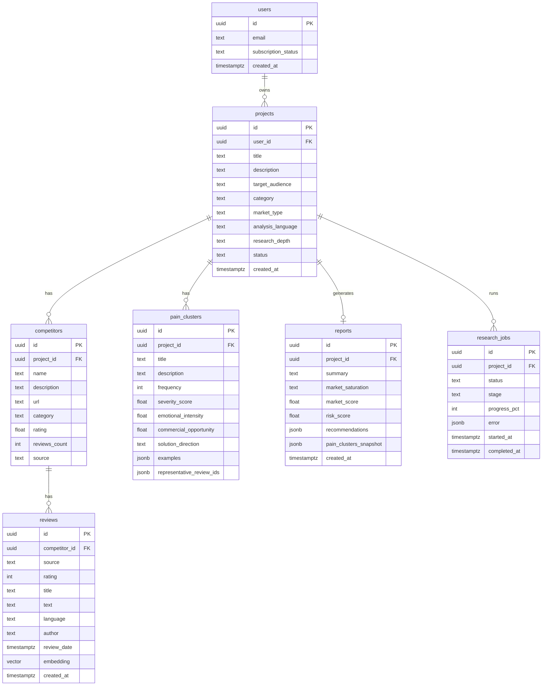

# AI Market Pain Research Platform — План разработки MVP

> **Главный принцип:** продукт — не «AI-генератор красивых отчётов». Ценность = качество собранных данных + обнаружение повторяющихся реальных болей. GPT оформляет выводы, но не заменяет сбор и кластеризацию.
>
> **Scope MVP:** сразу продукт (auth → исследование → отчёт). Лендинг — после подтверждения ценности.

---

## Содержание

1. [Персоны и критический путь](#1-персоны-и-критический-путь)
2. [Архитектура и репозиторий](#2-архитектура-и-репозиторий)
3. [Фазы разработки](#3-фазы-разработки)
4. [Модель данных](#4-модель-данных)
5. [API-контракты (черновик)](#5-api-контракты-черновик)
6. [Data Collection (G2 + Capterra)](#6-data-collection-g2--capterra)
7. [AI Pipeline](#7-ai-pipeline)
8. [Формат отчёта](#8-формат-отчёта)
9. [Инфраструктура и деплой](#9-инфраструктура-и-деплой)
10. [Мониторинг и качество](#10-мониторинг-и-качество)
11. [Что сознательно не делаем в MVP](#11-что-сознательно-не-делаем-в-mvp)
12. [Критерии готовности MVP](#12-критерии-готовности-mvp)
13. [Порядок работ (backlog по спринтам)](#13-порядок-работ-backlog-по-спринтам)
14. [UI: загрузки, анимации, иконки](#14-ui-загрузки-анимации-иконки)
15. [Skills и MCP по этапам](#15-skills-и-mcp-по-этапам)

---

## 1. Персоны и критический путь

### Персона

**Соло-фаундер / инди-разработчик** — есть идея продукта, ограниченное время и бюджет. Нужно быстро понять: «есть ли реальная боль на рынке или я трачу месяцы впустую».

### Главная задача за одну сессию

Ввести идею → получить структурированный отчёт с доказательствами (цитаты, частота, severity) → принять решение: строить / pivot / отказаться.

### Критический UX-путь (без лендинга)

```
Sign up / Log in
    → Dashboard (история исследований)
        → New Research (форма идеи)
            → Progress (стадии: competitors → reviews → analysis → report)
                → Report (боли, цитаты, opportunity, risk, market score)
                    → Pay / Upgrade (если лимит исчерпан)
```

### Ключевые экраны продукта

| Экран | Зачем в потоке |
|-------|----------------|
| Auth (login/signup) | Supabase Auth, минимальное трение |
| Dashboard | Список исследований, статус, быстрый доступ к отчётам |
| New Research | Ввод идеи + параметры (рынок, язык, глубина) |
| Research Progress | Прозрачность: что система делает прямо сейчас |
| Report View | Главный deliverable — боли с доказательствами, не «стена текста от GPT» |
| Billing (минимальный) | Stripe checkout, лимиты бесплатного tier |

### Эмоция и тон

- **Честный аналитик**, не hype-marketing
- Прогресс и прозрачность («мы нашли 847 отзывов, 12 кластеров боли»)
- Отчёт читается за 5–10 минут, каждая боль подкреплена цитатами

### Анти-паттерны (не строим)

- CRUD-админка с sidebar на 10 пунктов
- «Красивый PDF от ChatGPT» без сырых данных и цитат
- Таблицы ради таблиц
- Лендинг до рабочего core loop
- Голый `<Spinner />` или текст «Loading…» на экранах с ожиданием > 1 сек
- Типичные AI-клише: ✨ Sparkles, 🤖 Bot, фиолетовые gradient-orbs «как у ChatGPT»

---

## 2. Архитектура и репозиторий

### Monorepo-структура

```
reserchmarket/
├── apps/
│   ├── web/                 # Next.js 15 (App Router)
│   └── api/                 # FastAPI
├── workers/
│   ├── collector/           # Playwright scrapers (G2, Capterra)
│   └── pipeline/            # AI pipeline (clean → embed → cluster → LLM)
├── packages/
│   └── shared/              # Pydantic schemas, типы (optional, phase 2)
├── infra/
│   ├── docker/              # Dockerfiles для Railway
│   └── supabase/            # migrations, RLS policies
├── DEVELOPMENT_PLAN.md      # этот файл
└── README.md
```

### Поток данных

```
Next.js (Vercel)
    │ REST / SSE
    ▼
FastAPI (Railway)
    │ enqueue
    ▼
Celery + Redis (Railway)
    ├── collector worker (Playwright)
    └── pipeline worker (embeddings, HDBSCAN, GPT)
    │
    ▼
Supabase PostgreSQL (+ pgvector)
    │
    ▼
Report → Frontend (polling или SSE)
```

### Стек (фиксированный)

| Слой | Технологии |
|------|------------|
| Frontend | Next.js 15, TypeScript, Tailwind CSS v4, shadcn/ui, TanStack Query, React Hook Form |
| Анимации | Framer Motion, Lottie (`lottie-react`) |
| Иконки | Lucide (UI chrome) + Phosphor Duotone / Lordicon (AI-состояния, не типичные AI-клише) |
| Backend | Python 3.12, FastAPI, Pydantic v2, SQLAlchemy 2 |
| Queue | Celery, Redis |
| Scraping | Playwright (Python) |
| DB + Auth | Supabase (PostgreSQL, Auth, Storage, pgvector) |
| AI | OpenAI Embeddings + GPT (fallback: BGE local — phase 2) |
| ML | HDBSCAN, scikit-learn, pandas, langdetect |
| Deploy | Vercel (web), Railway (api, workers, redis) |
| Monitoring | Sentry, structured logging |

---

## 3. Фазы разработки

### Phase 0 — Foundation (неделя 1)

**Цель:** скелет проекта, auth, пустая БД, деплой «hello world».

> **Agent toolkit:** [§15.2 Phase 0](#phase-0--foundation)

- [x] Инициализация monorepo: `apps/web`, `apps/api`, `workers/`
- [x] Supabase project: Auth, PostgreSQL, pgvector extension (migration в `infra/supabase/`)
- [ ] SQLAlchemy models + Alembic/Supabase migrations (schema SQL готов, ORM — Phase 1)
- [x] FastAPI: health, CORS, auth middleware (Supabase JWT)
- [x] Next.js: auth flow (Supabase client), protected routes
- [x] UI foundation: `LoadingShell`, skeleton-компоненты, Framer Motion setup (Lottie — Phase 1 progress)
- [x] Railway: API + Redis + placeholder worker (Dockerfile skeleton)
- [ ] Vercel: frontend preview deploy
- [ ] Sentry: web + api (env placeholders готовы)

**Exit criteria:** пользователь может зарегистрироваться и видеть пустой dashboard.

---

### Phase 1 — Research CRUD + Job Queue (неделя 2)

**Цель:** создать исследование, поставить задачу в очередь, видеть статус.

> **Agent toolkit:** [§15.2 Phase 1](#phase-1--research-crud--job-queue)

- [x] Таблицы: `projects`, `research_jobs` (status, stage, progress %)
- [x] API: `POST /projects`, `GET /projects`, `GET /projects/{id}`
- [x] Celery: базовая задача `run_research(project_id)` с mock-стадиями
- [x] Frontend: форма New Research, Dashboard со статусами
- [x] Progress screen: polling по стадиям
  - `queued` → `finding_competitors` → `collecting_reviews` → `analyzing` → `generating_report` → `completed` / `failed`
- [ ] **Research Progress UI:** полноэкранный loading experience — Lottie-анимация по стадии, stepper с micro-animations (Framer Motion), live-счётчики («847 отзывов собрано»)

**Exit criteria:** пользователь создаёт исследование, видит прогресс (пока на mock-данных). Ожидание ощущается «живым», не пустым.

---

### Phase 2 — Competitor Discovery (неделя 3)

**Цель:** реальный поиск конкурентов — первый слой ценности (не GPT).

> **Agent toolkit:** [§15.2 Phase 2](#phase-2--competitor-discovery)

- [ ] LLM-assisted competitor discovery: по title + description + category → список 5–15 продуктов
- [ ] Валидация: каждый конкурент должен иметь URL на G2 или Capterra
- [ ] Таблица `competitors`, сохранение metadata (name, url, source, rating, reviews_count)
- [ ] Ручной fallback: если авто-поиск нашёл < 3 — показать пользователю «добавь конкурента вручную» (опционально в MVP)
- [ ] Unit-тесты на парсинг и нормализацию имён продуктов

**Exit criteria:** для «Invoice software for freelancers» система находит FreshBooks, QuickBooks, Wave и т.д. с URL и базовой metadata.

**Quality gate:** минимум 3 конкурента с валидным URL на G2/Capterra, иначе job → `failed` с понятной ошибкой.

---

### Phase 3 — Data Collection: G2 + Capterra (недели 4–5)

**Цель:** ядро продукта — сбор реальных отзывов. Без этого GPT бесполезен.

> **Agent toolkit:** [§15.2 Phase 3](#phase-3--data-collection)

#### 3.1 Playwright Collector Service

- [ ] Docker-образ с Playwright + Chromium
- [ ] G2 scraper:
  - страница продукта → rating, reviews_count
  - страница отзывов → paginate, extract: text, rating, date, title, author (if available)
- [ ] Capterra scraper: аналогично
- [ ] Rate limiting, retry с exponential backoff
- [ ] Dedup по hash(text + source + competitor_id)
- [ ] Сохранение в `reviews` (batch insert)
- [ ] Логирование: сколько отзывов собрано, сколько страниц, ошибки

#### 3.2 Ограничения MVP по сбору

| Параметр | Значение по умолчанию |
|----------|----------------------|
| Max competitors per research | 10 |
| Max reviews per competitor | 200 |
| Min review length | 50 chars |
| Sources | G2, Capterra only |

#### 3.3 Resilience

- [ ] Partial success: если 7/10 конкурентов собраны — продолжать pipeline
- [ ] Captcha/block detection → fail gracefully, retry later
- [ ] Snapshot raw HTML в Supabase Storage (debug, phase 2)

**Exit criteria:** для одного research собирается 500+ уникальных отзывов с G2/Capterra, сохраняются в БД.

**Quality gate:** ≥ 100 отзывов суммарно, иначе report с предупреждением «недостаточно данных».

---

### Phase 4 — AI Pipeline: Clean → Embed → Cluster (неделя 6)

**Цель:** найти повторяющиеся боли математически, не «попросить GPT придумать».

> **Agent toolkit:** [§15.2 Phase 4](#phase-4--ai-pipeline)

#### 4.1 Data Cleaning

- [ ] Удаление дубликатов (exact + near-duplicate via embedding cosine > 0.95)
- [ ] Фильтр коротких отзывов (< 50 chars)
- [ ] langdetect → фильтр по языку исследования
- [ ] Нормализация: strip HTML, lowercase для clustering (сохранять original для цитат)
- [ ] Фокус на негативных отзывах: rating ≤ 3 (настраиваемый порог)

#### 4.2 Embeddings

- [ ] OpenAI `text-embedding-3-small` (или `3-large` для quality tier)
- [ ] Batch embed (chunks of 100)
- [ ] Сохранение в `reviews.embedding` (pgvector)
- [ ] Индекс: `CREATE INDEX ON reviews USING ivfflat (embedding vector_cosine_ops)`

#### 4.3 Clustering

- [ ] HDBSCAN на embedding matrix
- [ ] Min cluster size: 5 reviews
- [ ] Noise cluster → отбрасываем или помечаем «minor»
- [ ] Для каждого кластера: top representative reviews (closest to centroid)
- [ ] Сохранение в `pain_clusters`: title (placeholder), frequency, severity_score, examples[]

**Exit criteria:** кластеры типа «Hard onboarding», «Too expensive», «Missing feature X» с frequency ≥ 5.

---

### Phase 5 — AI Analysis + Report Generation (неделя 7)

**Цель:** LLM интерпретирует кластеры, но не выдумывает — только на основе representative quotes.

> **Agent toolkit:** [§15.2 Phase 5](#phase-5--ai-analysis--report-generation)

#### 5.1 Per-cluster LLM analysis

Input: 5–10 representative quotes + cluster stats.

Output (structured JSON):
- `title` — название проблемы
- `description` — суть проблемы
- `frequency` — из данных
- `severity_score` — 1–10 (LLM + heuristic: avg rating inverse)
- `emotional_intensity` — 1–10
- `commercial_opportunity` — 1–10
- `solution_direction` — краткое направление
- `user_quotes` — 2–3 лучшие цитаты (verbatim из кластера)

#### 5.2 Report-level synthesis

- [ ] `market_saturation`: HIGH / MEDIUM / LOW (на основе кол-ва конкурентов + avg rating spread)
- [ ] `market_score`: 0–100
- [ ] `risk_score`: 0–100
- [ ] `summary`: 2–3 абзаца
- [ ] `recommendations`: build / pivot / don't build + reasoning
- [ ] Сохранение в `reports`

#### 5.3 Prompt constraints (критично)

```
- Каждое утверждение MUST ссылаться на конкретные цитаты
- Запрещено добавлять проблемы, не подтверждённые кластерами
- Если данных мало — явно указать uncertainty
```

**Exit criteria:** полный отчёт для тестовой идеи, каждая боль имеет ≥ 2 цитаты и frequency.

---

### Phase 6 — Report UI + History (неделя 8)

**Цель:** deliverable, ради которого платят.

> **Agent toolkit:** [§15.2 Phase 6](#phase-6--report-ui--history)

- [ ] Report View:
  - Header: idea, market saturation badge, scores
  - Pain cards: title, severity bar, frequency, quotes block, opportunity
  - Competitors section: таблица/карточки с rating и review count
  - Risk section
  - Recommendations (actionable)
- [ ] Dashboard: список исследований, фильтр по status
- [ ] Re-run research (новая job для того же project)
- [ ] Export: Markdown / PDF (phase 2, optional stub)
- [ ] Skeleton → staggered reveal для pain cards и competitor cards (Framer Motion)
- [ ] Inline loading: «показать ещё отзывы», retry, checkout — осмысленные состояния, не generic spinner

**UX-принцип:** цитаты — первичны, GPT-summary — вторичен. Пользователь может «проверить» вывод, кликнув на quotes.

---

### Phase 7 — Billing + Limits (неделя 9)

**Цель:** проверить готовность платить.

> **Agent toolkit:** [§15.2 Phase 7](#phase-7--billing--limits)

- [ ] Stripe Checkout integration
- [ ] Tiers:
  - **Free:** 1 research / month, depth: shallow (5 competitors, 50 reviews each)
  - **Pro:** N researches, full depth
- [ ] `users.subscription_status` sync via Stripe webhooks
- [ ] Paywall на создание research при исчерпании лимита
- [ ] Upgrade CTA на Report page

---

### Phase 8 — Hardening + Beta (неделя 10)

> **Agent toolkit:** [§15.2 Phase 8](#phase-8--hardening--beta)

- [ ] E2E test: full research flow (staging)
- [ ] Load test: 5 concurrent researches
- [ ] Scraper health checks (G2/Capterra layout changes)
- [ ] Error states UI: failed job, partial data, retry button
- [ ] Onboarding tooltip на первом research
- [ ] Beta invite 5–10 соло-фаундеров

---

## 4. Модель данных

### ER-диаграмма



### RLS (Supabase)

- `projects`: user видит только свои (`user_id = auth.uid()`)
- Cascade через project_id для competitors, reviews, clusters, reports
- Service role для workers (bypass RLS)

### Индексы

```sql
CREATE INDEX idx_projects_user_id ON projects(user_id);
CREATE INDEX idx_competitors_project_id ON competitors(project_id);
CREATE INDEX idx_reviews_competitor_id ON reviews(competitor_id);
CREATE INDEX idx_reviews_embedding ON reviews USING ivfflat (embedding vector_cosine_ops);
CREATE INDEX idx_pain_clusters_project_id ON pain_clusters(project_id);
CREATE INDEX idx_research_jobs_project_id ON research_jobs(project_id);
```

---

## 5. API-контракты (черновик)

### Projects

```
POST   /api/v1/projects          — создать исследование + enqueue job
GET    /api/v1/projects          — список (pagination)
GET    /api/v1/projects/{id}     — детали + status
DELETE /api/v1/projects/{id}     — удалить (soft delete, phase 2)
```

### Research Jobs

```
GET    /api/v1/projects/{id}/status     — текущая стадия + progress
GET    /api/v1/projects/{id}/stream     — SSE events (optional)
POST   /api/v1/projects/{id}/retry      — перезапуск failed job
```

### Report

```
GET    /api/v1/projects/{id}/report     — финальный отчёт
GET    /api/v1/projects/{id}/competitors
GET    /api/v1/projects/{id}/reviews?competitor_id=&page=
GET    /api/v1/projects/{id}/pain-clusters
```

### Billing

```
POST   /api/v1/billing/checkout         — Stripe session
POST   /api/v1/billing/webhook          — Stripe events
GET    /api/v1/billing/usage            — лимиты и consumption
```

### Auth

Все endpoints (кроме webhook) — `Authorization: Bearer <supabase_jwt>`.

---

## 6. Data Collection (G2 + Capterra)

### Competitor Discovery Flow

```
1. Input: title, description, category, market_type
2. LLM prompt: "List top SaaS competitors for {idea} in {category}"
3. For each name → search G2/Capterra URL (Playwright or constructed URL pattern)
4. Validate: page exists, has reviews
5. Save to competitors table
```

### Review Scraping Flow

```
For each competitor:
  1. Navigate to reviews page (G2: /products/{slug}/reviews)
  2. Scroll / paginate until max_reviews or no more pages
  3. Extract: rating, title, text, date, author
  4. Filter: rating <= threshold (default 3)
  5. Dedup + batch insert
  6. Update progress: collecting_reviews (X/Y competitors done)
```

### Scraper Maintenance

- [ ] Selector config в YAML (не hardcode в коде)
- [ ] Weekly cron: smoke test на 3 известных продуктах
- [ ] Alert в Sentry при 0 reviews collected

---

## 7. AI Pipeline

### Pipeline DAG (Celery chain)

```
discover_competitors
    → collect_reviews (parallel per competitor, chord)
        → clean_reviews
            → embed_reviews
                → cluster_reviews
                    → analyze_clusters (parallel per cluster)
                        → generate_report
                            → notify_complete
```

### Конфигурация по глубине исследования

| Depth | Competitors | Reviews/competitor | Clusters min size |
|-------|-------------|--------------------|--------------------|
| shallow | 5 | 50 | 8 |
| standard | 10 | 100 | 5 |
| deep | 15 | 200 | 3 |

### Cost estimation (per research, standard)

| Step | Approx cost |
|------|-------------|
| Competitor discovery (GPT-4o-mini) | $0.01 |
| Embeddings (1000 reviews × 3-small) | $0.02 |
| Cluster analysis (10 clusters × GPT-4o) | $0.15 |
| Report synthesis (GPT-4o) | $0.05 |
| **Total** | **~$0.25** |

---

## 8. Формат отчёта

### Структура (UI + API response)

```yaml
idea:
  title: "Invoice app for freelancers"
  description: "..."
  category: "Accounting / Invoicing"

scores:
  market_saturation: HIGH          # HIGH | MEDIUM | LOW
  market_score: 42                   # 0-100, higher = more opportunity
  risk_score: 68                     # 0-100, higher = more risk

summary: |
  2-3 paragraphs, grounded in data stats

competitors:
  - name: FreshBooks
    url: https://g2.com/...
    rating: 4.5
    reviews_count: 1250
    source: g2

pain_clusters:
  - title: "Manual data entry"
    description: "Users complain about..."
    frequency: 342
    severity_score: 8
    emotional_intensity: 7
    commercial_opportunity: 9
    solution_direction: "Automatic invoice creation without accounting complexity"
    quotes:
      - text: "I stopped using it because..."
        source: g2
        rating: 2
        competitor: FreshBooks

recommendations:
  verdict: pivot | build | dont_build
  reasoning: "..."
  next_steps:
    - "Focus on automatic invoice from time tracking"
    - "Target freelancers, not small businesses"
```

---

## 9. Инфраструктура и деплой

### Vercel (Frontend)

- `apps/web`
- Env: `NEXT_PUBLIC_SUPABASE_URL`, `NEXT_PUBLIC_SUPABASE_ANON_KEY`, `NEXT_PUBLIC_API_URL`
- Preview deploys on PR

### Railway (Backend + Workers)

| Service | Image | Notes |
|---------|-------|-------|
| api | `apps/api/Dockerfile` | FastAPI, 1+ replicas |
| worker-collector | `workers/collector/Dockerfile` | Playwright, memory ≥ 2GB |
| worker-pipeline | `workers/pipeline/Dockerfile` | CPU-heavy |
| redis | Railway Redis plugin | Celery broker |

### Env vars (shared)

```
SUPABASE_URL
SUPABASE_SERVICE_ROLE_KEY
DATABASE_URL
REDIS_URL
OPENAI_API_KEY
STRIPE_SECRET_KEY
STRIPE_WEBHOOK_SECRET
SENTRY_DSN
```

### CI/CD

- GitHub Actions: lint + test on PR
- Auto-deploy: main → production, PR → preview

---

## 10. Мониторинг и качество

### Sentry

- Frontend: unhandled errors, API failures
- Backend: exceptions, slow queries
- Workers: scraper failures, pipeline errors

### Logging (structured JSON)

```json
{
  "event": "reviews_collected",
  "project_id": "...",
  "competitor": "FreshBooks",
  "count": 187,
  "source": "g2",
  "duration_ms": 45000
}
```

### Queue monitoring

- Celery Flower (internal, Railway private network)
- Alert: queue depth > 50 или task age > 30 min

### Data quality metrics (product analytics)

| Metric | Target |
|--------|--------|
| Avg reviews per research | ≥ 300 |
| Avg pain clusters | ≥ 5 |
| Report generation time | < 15 min (standard) |
| Scraper success rate | ≥ 80% |
| User retry rate | < 20% |

---

## 11. Что сознательно не делаем в MVP

- [ ] Лендинг / marketing site
- [ ] X (Twitter) API, Reddit, App Store, Google Play, Google Trends
- [ ] Мобильное приложение
- [ ] Десятки источников данных
- [ ] Автоматический «анализ всего интернета»
- [ ] Сложная custom ML-модель
- [ ] Real-time collaborative editing
- [ ] White-label / API для third parties
- [ ] Multi-language UI (только EN UI, analysis language — configurable)

---

## 12. Критерии готовности MVP

### Технические

- [ ] E2E: signup → create research → report in < 20 min (standard depth)
- [ ] ≥ 100 real reviews collected per research (standard)
- [ ] ≥ 5 pain clusters with quotes per research
- [ ] Failed jobs recoverable via retry
- [ ] Payment flow works (Stripe test mode → prod)

### Продуктовые (главная метрика)

> **MVP успешен, если пользователь после отчёта говорит:**
> *«Этот анализ изменил моё решение о продукте.»*

Измеряем:

- [ ] ≥ 30% beta users complete full research flow
- [ ] ≥ 20% express willingness to pay (survey or actual conversion)
- [ ] Qualitative: 3+ users cite specific pain cluster (not generic GPT text) as decision factor

### Quality bar (отличие от ChatGPT)

- [ ] Каждая боль в отчёте имеет frequency ≥ 5 и ≥ 2 verbatim quotes
- [ ] Пользователь может открыть raw reviews и проверить кластер
- [ ] При < 100 reviews — explicit warning, не fake confidence

---

## 13. Порядок работ (backlog по спринтам)

### Sprint 1 (Foundation)
1. Monorepo scaffold
2. Supabase setup + migrations
3. Auth (web + api)
4. Deploy skeleton
5. UI loading foundation: Framer Motion, Lottie, skeletons, icon libs (см. [§14](#14-ui-загрузки-анимации-иконки))

### Sprint 2 (Core Loop Mock)
6. Project CRUD API
7. Celery + Redis wiring
8. New Research form + Dashboard (skeleton loading)
9. Progress screen (mock stages + Lottie per stage)

### Sprint 3 (Competitor Discovery)
10. LLM competitor discovery
11. G2/Capterra URL validation
12. Competitors API + UI preview

### Sprint 4–5 (Scraping)
13. Playwright G2 scraper
14. Playwright Capterra scraper
15. Collector worker + job integration
16. Review storage + dedup

### Sprint 6 (AI Pipeline)
17. Data cleaning module
18. Embeddings + pgvector
19. HDBSCAN clustering
20. Pipeline worker chain

### Sprint 7 (Report)
21. Cluster LLM analysis
22. Report synthesis
23. Report UI + staggered reveal animations

### Sprint 8 (Monetization)
24. Stripe integration
25. Usage limits
26. Paywall

### Sprint 9 (Beta)
27. E2E tests
28. Error handling polish + loading/error Lottie states
29. Beta launch (5–10 users)
30. Iterate on scraper reliability

### Sprint 10+ (Post-MVP, не сейчас)
- Landing page
- PDF export
- Reddit / X sources
- BGE local embeddings (cost optimization)
- Team accounts

---

## Риски и митигация

| Риск | Вероятность | Митигация |
|------|-------------|-----------|
| G2/Capterra блокируют scraper | Высокая | Rate limits, rotating UA, fallback to manual competitor input |
| Мало негативных отзывов | Средняя | Снижать rating threshold, включать 4-star «mixed» |
| GPT галлюцинирует боли | Средняя | Strict prompt + cluster-only input + quotes mandatory |
| Долгое время research | Средняя | Parallel scraping, progress UI, shallow tier |
| Пользователь не платит | Средняя | Beta interviews до billing, free tier с watermark |

---

## 14. UI: загрузки, анимации, иконки

> **Правило:** любое место, где пользователь ждёт > 1 сек, получает **осмысленное loading-состояние** — не голый spinner и не «Loading…». Долгое ожидание (research pipeline) — **главный UX-момент**: здесь строим доверие через прозрачность и качественную анимацию.

### Карта loading-состояний

| Место | Тип ожидания | UI-паттерн |
|-------|--------------|------------|
| Auth (login/signup) | 0.5–2 сек | Button loading state + subtle pulse на форме |
| Dashboard (первый fetch) | 0.5–3 сек | Skeleton cards (3–5 шт.), staggered fade-in |
| New Research (submit) | 1–3 сек | Full-width progress bar + «Starting research…» |
| **Research Progress** | **3–15 мин** | **Hero Lottie + stepper + live counters + stage copy** |
| Report View (fetch) | 1–5 сек | Skeleton: header → scores → pain cards → competitors |
| Report sections (expand quotes) | 0.3–1 сек | Inline shimmer / mini skeleton внутри карточки |
| Competitors / reviews pagination | 0.5–2 сек | Skeleton rows, preserve layout (no layout shift) |
| Retry / re-run research | 1–3 сек | Тот же Progress UI, pre-filled context |
| Stripe checkout redirect | 1–5 сек | Branded overlay + «Redirecting to checkout…» |
| Failed / partial state | — | Illustration (Lottie static frame) + clear CTA, не пустой экран |

### Библиотеки анимаций

| Библиотека | Назначение | Где использовать |
|------------|------------|------------------|
| **Framer Motion** (`framer-motion`) | Layout transitions, stagger, stepper, page enter/exit | Dashboard reveal, pain cards, progress stepper, modal |
| **Lottie** (`lottie-react`) | Rich loop-анимации для длительных процессов | Research Progress hero, empty states, error illustrations |
| **shadcn Skeleton** | Контентные placeholder'ы | Lists, cards, report sections |
| **Tailwind `animate-*`** | Micro-interactions | Progress bar, pulse on live counters, badge transitions |

**Lottie-ассеты (подобрать на [LottieFiles](https://lottiefiles.com), не generic AI):**

| Стадия research | Характер анимации |
|-----------------|-------------------|
| `finding_competitors` | Поиск / radar / map pins |
| `collecting_reviews` | Поток данных / документы / scraping |
| `analyzing` | Clustering / nodes connecting (не «мозг» и не sparkles) |
| `generating_report` | Сборка отчёта / layers stacking |
| `completed` | Check / reveal (короткая, не confetti) |
| `failed` | Calm error (не красный треугольник stock) |

Анимации — **спокойные, аналитические**, в тон «честного аналитика». Без neon, без «magic AI» aesthetic.

### Иконки: двухслойная система

**Не смешивать всё в одну библиотеку.** Lucide — для привычного UI chrome. Отдельный слой — для AI/research семантики с **нетипичным** характером.

| Слой | Библиотека | npm | Когда |
|------|------------|-----|-------|
| UI chrome | **Lucide** | `lucide-react` | Nav, buttons, close, chevrons, settings, auth — shadcn default |
| Research / data | **Phosphor Duotone** | `@phosphor-icons/react` | Pain severity, market saturation, risk, data collection — duotone даёт глубину без AI-клише |
| Animated accents | **Lordicon** (optional) | `@lordicon/react` | 1–2 accent-иконки на Progress screen (hover/play), не везде |

**Запрещено как primary AI-иконки:**

- Lucide `Sparkles`, `Bot`, `Brain` — слишком generic «AI wrapper»
- Emoji как иконки (🔥 ✅ 🤖)
- `@heroicons/react`, `react-icons` mix — без явного запроса
- Stock purple gradient orbs / «ChatGPT-style» декор

**Рекомендуемые Phosphor Duotone для продукта:**

| Семантика | Иконка Phosphor | Вместо |
|-----------|-----------------|--------|
| Market research | `MagnifyingGlassChart`, `ChartLineUp` | generic Search |
| User pain | `WarningOctagon`, `ThumbsDown` | AlertCircle |
| Opportunity | `LightbulbFilament`, `TrendUp` | Sparkles |
| Competitors | `UsersThree`, `Sword` | Users |
| Reviews / evidence | `Quotes`, `Article` | FileText |
| Clustering | `CirclesThreePlus`, `Graph` | Brain |
| Risk | `ShieldWarning`, `Scales` | AlertTriangle |
| Report ready | `FileMagnifyingGlass`, `ClipboardText` | FileCheck |

### Shared components (создать в Phase 0)

```
apps/web/components/ui/
├── skeleton-card.tsx          # shadcn Skeleton wrapper
├── loading-shell.tsx          # full-page / section loading layout
├── research-progress-hero.tsx # Lottie + stage label + counter
├── stage-stepper.tsx          # Framer Motion stepper
├── stagger-list.tsx           # Framer Motion list reveal
└── icons/
    ├── ui-icon.tsx            # Lucide wrapper (size, aria)
    └── research-icon.tsx      # Phosphor Duotone wrapper
```

### Принципы реализации

1. **Layout stability** — skeleton повторяет финальный layout (нет CLS при загрузке)
2. **Progressive disclosure** — report sections появляются staggered, не одним блоком
3. **Live feedback** — на Progress screen счётчики обновляются из API (`reviews_collected`, `competitors_found`)
4. **Reduced motion** — `prefers-reduced-motion`: Lottie → static frame, Framer → instant/no stagger
5. **Performance** — Lottie JSON < 100 KB каждый; lazy-load анимации не на Dashboard
6. **Consistency** — один `LoadingShell` для всех full-page states, один `ResearchIcon` / `UiIcon` wrapper

### Критерии качества loading UX

- [ ] Нет экранов с единственным `<Spinner />` без контекста
- [ ] Research Progress: Lottie + stepper + текст «что происходит сейчас» + live counters
- [ ] Dashboard и Report: skeleton, совпадающий с финальной вёрсткой
- [ ] AI/research иконки — Phosphor Duotone (или Lordicon), не Lucide Sparkles/Bot
- [ ] `prefers-reduced-motion` respected
- [ ] Переход loading → content через crossfade (Framer Motion), не резкий pop

---

## 15. Skills и MCP по этапам

> **Для агента:** перед работой над фазой — прочитать указанные **Skills** (`Read` на `SKILL.md`) и проверить схему **MCP tools** в `mcps/<server>/tools/`. Не использовать MCP/skills «на автомате» — только там, где они дают реальное преимущество.

### 15.1 Общие правила выбора инструментов

| Тип задачи | Первый выбор | Не использовать |
|------------|--------------|-----------------|
| Актуальная документация библиотеки | MCP **context7** (`resolve-library-id` → `query-docs`) | Угадывать API из памяти |
| UX/UI продуктовых экранов | Skills **ui-ux-pro-max**, **design-system**, **ui-styling** | shadcn blocks / dashboard templates как готовый продукт |
| Иконки UI chrome | Skill **lucide-icons** | Emoji, heroicons, react-icons mix |
| Кастомные research-иконки | Skill **design** → `references/icon-design.md` | Lucide Sparkles / Bot / Brain |
| Сложный UI-компонент (pain card, stepper) | MCP **21st magic** `component_builder` → адаптация под design tokens | Копировать snippet без адаптации под поток |
| Инспекция DOM / E2E UI | MCP **cursor-ide-browser** | Scraping через browser MCP в prod workers |
| Исследование кодовой базы | Subagent **explore** | Ручной grep по всему monorepo без цели |
| Shell: git, docker, deploy | Subagent **shell** | — |
| Мультишаговая фича end-to-end | Subagent **generalPurpose** | — |

**Context7 — ключевые library IDs для проекта:**

| Библиотека | Context7 ID (пример) | Когда запрашивать |
|------------|----------------------|-------------------|
| Next.js 15 | `/vercel/next.js` | App Router, SSR, middleware, route handlers |
| Supabase | `/supabase/supabase` | Auth, RLS, pgvector, client/server setup |
| FastAPI | `/tiangolo/fastapi` | Routes, deps, Pydantic v2, middleware |
| SQLAlchemy 2 | `/sqlalchemy/sqlalchemy` | Models, async sessions, migrations |
| Celery | `/celery/celery` | Tasks, chains, chords, Redis broker |
| Playwright Python | `/microsoft/playwright-python` | Selectors, pagination, Docker |
| TanStack Query | `/tanstack/query` | Mutations, polling, cache keys |
| Framer Motion | `/framer/motion` | Stagger, AnimatePresence, stepper |
| Stripe | `/stripe/stripe-node` или `/stripe/stripe-python` | Checkout, webhooks |
| shadcn/ui | `/shadcn-ui/ui` | Component install, theming |
| Tailwind v4 | `/tailwindlabs/tailwindcss` | `@theme`, PostCSS setup |
| OpenAI | `/openai/openai-python` | Embeddings, structured outputs |
| HDBSCAN | `/scikit-learn/scikit-learn` + docs hdbscan | Clustering params |

---

### 15.2 Skills / MCP / Subagents по фазам

#### Phase 0 — Foundation

| Категория | Инструмент | Задача на этапе |
|-----------|------------|-----------------|
| **Skill** | `ui-ux-pro-max` | `--design-system` для «B2B research / analytics / honest analyst» — палитра, типографика, anti-patterns до первого экрана |
| **Skill** | `design-system` | Token architecture: primitive → semantic → component в Tailwind v4 |
| **Skill** | `brand` | Tone of voice: «честный аналитик», не hype-AI; inject-brand-context для промптов UI |
| **Skill** | `ui-styling` | shadcn init, базовый layout, auth forms |
| **Skill** | `lucide-icons` | Nav, auth, buttons — UI chrome |
| **MCP** | **context7** | Next.js App Router, Supabase Auth, FastAPI project structure, Tailwind v4 |
| **MCP** | **21st magic** `component_builder` | Auth card, empty dashboard shell — **адаптировать**, не dashboard template |
| **Subagent** | `shell` | Monorepo scaffold, Docker, Railway/Vercel env |
| **Subagent** | `explore` | Проверить структуру после scaffold |

---

#### Phase 1 — Research CRUD + Job Queue

| Категория | Инструмент | Задача на этапе |
|-----------|------------|-----------------|
| **Skill** | `ui-styling` | New Research form (React Hook Form + shadcn) |
| **Skill** | `ui-ux-pro-max` | UX guidelines: form validation, progress feedback, error states |
| **Skill** | `design-system` | Status badges, job stage tokens (`--status-running`, etc.) |
| **MCP** | **context7** | Celery + Redis wiring, TanStack Query mutations/polling, FastAPI CRUD |
| **MCP** | **21st magic** `component_builder` | Research form, dashboard list item, status badge |
| **MCP** | **21st magic** `component_refiner` | Полировка формы после первой итерации |
| **MCP** | **cursor-ide-browser** | Smoke test: signup → create research → progress mock |
| **Subagent** | `generalPurpose` | End-to-end wiring frontend ↔ API ↔ Celery mock chain |

---

#### Phase 2 — Competitor Discovery

| Категория | Инструмент | Задача на этапе |
|-----------|------------|-----------------|
| **MCP** | **context7** | OpenAI structured outputs, FastAPI background tasks |
| **MCP** | **cursor-ide-browser** | **Критично:** открыть G2/Capterra, изучить URL patterns, DOM product pages до написания scraper |
| **MCP** | **21st magic** `component_inspiration` | Competitor preview cards (reference only) |
| **Skill** | `ui-styling` | Competitor list UI на Progress screen |
| **Skill** | `lucide-icons` | ExternalLink, chevrons для competitor rows |
| **Subagent** | `explore` | Поиск существующих LLM/prompt patterns в codebase |
| **Subagent** | `generalPurpose` | Competitor discovery pipeline + URL validation logic |

---

#### Phase 3 — Data Collection

| Категория | Инструмент | Задача на этапе |
|-----------|------------|-----------------|
| **MCP** | **context7** | Playwright Python: pagination, waits, Docker headless, error handling |
| **MCP** | **cursor-ide-browser** | **Критично:** snapshot G2/Capterra review pages → selectors, scroll behavior, rate limit observation |
| **MCP** | **context7** | SQLAlchemy bulk insert, Supabase service role from workers |
| **Subagent** | `shell` | Playwright Docker build, Railway worker deploy |
| **Subagent** | `generalPurpose` | G2 scraper → Capterra scraper → dedup → progress callbacks |
| **Skill** | — | UI минимален; Progress counters уже из Phase 1 |

**Workflow агента для scraper:**
1. `cursor-ide-browser` → navigate G2 product reviews → snapshot DOM
2. `context7` → Playwright best practices для pagination
3. Implement → test locally → `shell` deploy worker

---

#### Phase 4 — AI Pipeline

| Категория | Инструмент | Задача на этапе |
|-----------|------------|-----------------|
| **MCP** | **context7** | OpenAI embeddings batch API, pgvector ops, pandas dedup patterns |
| **MCP** | **context7** | scikit-learn / HDBSCAN: min_cluster_size, metric, noise handling |
| **Subagent** | `generalPurpose` | Pipeline modules: clean → embed → cluster |
| **Subagent** | `explore` | Проверить schema `reviews.embedding`, индексы ivfflat |
| **Skill** | — | Backend-only; без UI skills |

**Не использовать:** 21st magic, ui-ux-pro-max — нет UI на этом этапе.

---

#### Phase 5 — AI Analysis + Report Generation

| Категория | Инструмент | Задача на этапе |
|-----------|------------|-----------------|
| **MCP** | **context7** | OpenAI structured outputs / JSON schema, prompt patterns для grounded analysis |
| **Subagent** | `generalPurpose` | Per-cluster analysis + report synthesis + Celery chain integration |
| **Subagent** | `explore` | Review prompt constraints в codebase, unit test fixtures |
| **Skill** | `brand` | Review LLM copy tone — analytical, not salesy |

**Quality check агента:** каждый prompt MUST include representative quotes; запрет hallucinated pains — проверять в тестах.

---

#### Phase 6 — Report UI + History

| Категория | Инструмент | Задача на этапе |
|-----------|------------|-----------------|
| **Skill** | `ui-ux-pro-max` | Chart/domain search: severity bars, market saturation badges, data-dense cards без clutter |
| **Skill** | `design-system` | Pain card, score badge, quote block — component tokens |
| **Skill** | `ui-styling` | shadcn Card, Badge, Collapsible для quotes |
| **Skill** | `design` → `icon-design.md` | Phosphor/Lordicon integration, custom icons если нужно |
| **Skill** | `lucide-icons` | Только UI chrome (expand, copy quote, external link) |
| **MCP** | **context7** | Framer Motion stagger, TanStack Query report fetch |
| **MCP** | **21st magic** `component_builder` | Pain cluster card, market score header, quote accordion |
| **MCP** | **21st magic** `component_refiner` | Report layout polish после первой версии |
| **MCP** | **cursor-ide-browser** | Visual QA: skeleton → content transition, stagger, mobile |
| **Subagent** | `generalPurpose` | Report page + dashboard history + re-run flow |

**См. также:** [§14 UI: загрузки, анимации, иконки](#14-ui-загрузки-анимации-иконки)

---

#### Phase 7 — Billing + Limits

| Категория | Инструмент | Задача на этапе |
|-----------|------------|-----------------|
| **MCP** | **context7** | Stripe Checkout Sessions, webhooks (FastAPI), idempotency |
| **Skill** | `ui-styling` | Paywall modal, upgrade CTA, usage meter |
| **Skill** | `ui-ux-pro-max` | UX: paywall timing (после ценности), не до первого research |
| **MCP** | **21st magic** `component_builder` | Pricing/upgrade card — **не SaaS landing**, minimal inline CTA |
| **MCP** | **cursor-ide-browser** | Checkout redirect flow, webhook smoke test |
| **Subagent** | `shell` | Stripe CLI webhook forwarding locally |

---

#### Phase 8 — Hardening + Beta

| Категория | Инструмент | Задача на этапе |
|-----------|------------|-----------------|
| **MCP** | **cursor-ide-browser** | **Primary E2E:** full flow signup → research → report; profile performance |
| **MCP** | **cursor-ide-browser** | `browser_profile_start/stop` — если research progress тормозит |
| **Skill** | `ui-ux-pro-max` | Accessibility checklist, reduced motion, error state UX |
| **MCP** | **context7** | Sentry Next.js + FastAPI setup |
| **Subagent** | `shell` | Load tests, Railway logs, Redis queue depth |
| **Subagent** | `explore` | Audit: нет голых spinners, нет Sparkles/Bot icons |

**Post-MVP (Sprint 10+):** Skill `banner-design`, `clone-website` — только для лендинга, не сейчас.

---

### 15.3 Матрица: Sprint → Skills / MCP

| Sprint | Фазы | Skills (приоритет) | MCP (приоритет) | Subagent |
|--------|------|--------------------|-----------------|----------|
| 1 Foundation | 0 | ui-ux-pro-max, design-system, brand, ui-styling, lucide-icons | context7, 21st builder | shell, explore |
| 2 Core Loop | 1 | ui-styling, ui-ux-pro-max, design-system | context7, 21st builder/refiner, browser | generalPurpose |
| 3 Competitors | 2 | ui-styling, lucide-icons | **browser**, context7, 21st inspiration | generalPurpose |
| 4–5 Scraping | 3 | — | **browser**, context7 (Playwright) | shell, generalPurpose |
| 6 AI Pipeline | 4 | — | context7 (OpenAI, pgvector, HDBSCAN) | generalPurpose, explore |
| 7 Report backend | 5 | brand | context7 (OpenAI structured) | generalPurpose |
| 7 Report UI | 6 | ui-ux-pro-max, design-system, ui-styling, design/icons, lucide-icons | 21st builder/refiner, context7 (Framer), **browser** | generalPurpose |
| 8 Billing | 7 | ui-styling, ui-ux-pro-max | context7 (Stripe), 21st builder, browser | shell |
| 9 Beta | 8 | ui-ux-pro-max | **browser** (E2E), context7 (Sentry) | shell, explore |

---

### 15.4 MCP servers: когда НЕ использовать

| MCP | Не использовать для |
|-----|---------------------|
| **21st magic** | Backend, scrapers, AI pipeline; готовых dashboard/sidebar layouts; копирования snippet без адаптации |
| **cursor-ide-browser** | Production scraping (только dev/debug/E2E); обход captcha |
| **context7** | Бизнес-логики, prompt engineering, рефакторинг без вопроса по API |
| **cloudflare-*** | MVP infra (стек: Vercel + Railway + Supabase) — только если миграция позже |

---

### 15.5 Чеклист агента перед завершением фазы

- [ ] Прочитаны Skills, указанные для фазы
- [ ] Context7 запросы — по одной теме, не «всё сразу»
- [ ] UI-компоненты из 21st — адаптированы под tokens из `design-system`
- [ ] Loading states соответствуют [§14](#14-ui-загрузки-анимации-иконки)
- [ ] Browser MCP — smoke test пройден для frontend-фаз
- [ ] Нет anti-patterns из [§1](#1-персоны-и-критический-путь) и [§11](#11-что-сознательно-не-делаем-в-mvp)

---

*Последнее обновление: 2026-07-08*
*Статус: Phase 1 — реализована (CRUD + Celery mock pipeline + progress UI). Требует `apps/api/.env` + migration 002.*
